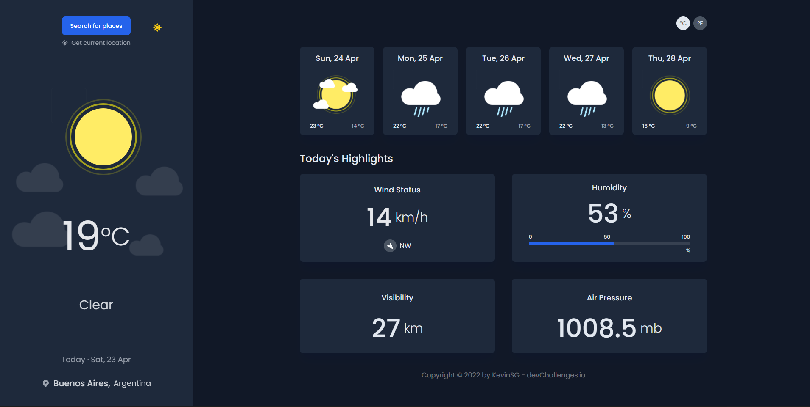
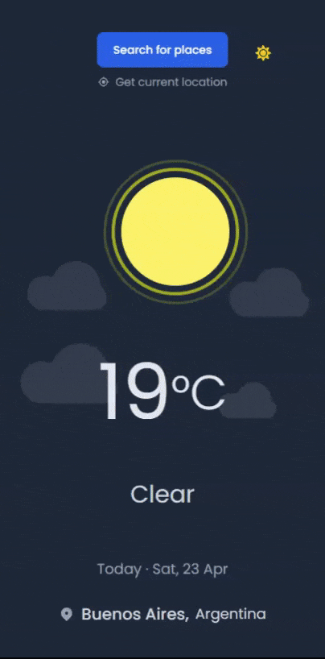

<h1 align="center"> :sun_behind_small_cloud: Weather App </h1>

<p align="center"> :fire: Solution for a challengue from <a href="http://devchallenges.io" target="_blank">Devchallenges.io</a>
</p>

<br />

<div>
  <p>:blue_book: <strong>About: </strong>See the weather in your city/state or anywhere in the world.</p>
</div>

## :crossed_swords: The Challengue

Users should be able to see or perform:

- [x] City weather by default, preferably current location
- [x] Search by any city
- [x] Weather of today and the next 5 days
- [x] The date and location of the weather
- [x] According to image for each type of weather
- [x] The min and max degree each day
- [x] Wind status and wind direction
- [x] Humidity percentage
- [x] Visibility indicator
- [x] Request current location weather
- [x] Convert temperature in Celsius to Fahrenheit

<div>
    <h2>:gear: Plus</h2>
    <p>:heavy_check_mark: The user can get the location by clicking a button.</p>
    <p>:heavy_check_mark: DarkMode</p>
</div>

<div>
  <h2>:desktop_computer: Desktop</h2>
  
</div>

<div>
  <h2>:iphone: Mobile</h2>
  
</div>

## Link

:black_flag: Demo URL: [Weather_app](https://weather-app-vite-ks.netlify.app/)

:shield: Challengue: [Challengue](https://devchallenges.io/)

## :desktop_computer: Technologies

- ReactJS
- ViteJs
- Typescript
- React icons
- Redux Toolkit
- Tailwindcss

## :satellite: APIs used in the application

- :sunny: [MetaWeather](https://www.metaweather.com/)

## :pushpin: How To Use

```bash
# Clone this repository
$ git clone https://github.com/kevin-sg/weather-app-vite

# Go into the repository
$ cd weather-app-vite

# Install dependencies
$ yarn install

# Run the application
$ yarn dev

```
